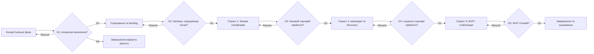

# Побудова життєвого циклу проєкту InteresMe

## Обрана модель життєвого циклу

Для InteresMe обрано конкретну модель життєвого циклу **Scrum**, яка належить до сучасної класифікації **адаптивна / Agile**. Вибір відповідає startup-середовищу проєкту, де вимоги можуть змінюватися під час перевірки продуктових гіпотез. Високий рівень невизначеності ускладнює повне визначення функціональності на початку, тому потрібні короткі ітерації, інкрементальна поставка та частий зворотний зв'язок. У цьому документі Scrum є запропонованою моделлю життєвого циклу навчального проєкту, а не твердженням про її повне впровадження у production.

## Фази життєвого циклу

| № | Назва фази | Мета фази | Тривалість у тижнях | Ключові роботи | Deliverables | Відповідальний |
|---:|---|---|---:|---|---|---|
| 1 | Концептуальна фаза | Уточнити цінність InteresMe, цільову аудиторію та межі навчального MVP. | 1 | Перевірка проблеми пошуку людей, спільнот та ініціатив за інтересами; фіксація цільових сценаріїв; визначення обмежень і припущень. | Опис концепції; визначена цільова аудиторія; перелік продуктових гіпотез; початкові межі MVP. | Maksym Rytchenko / Team Lead |
| 2 | Планування та підготовка backlog | Перетворити концепцію на впорядкований план інкрементальної розробки. | 2 | Формування та пріоритизація backlog; декомпозиція задач за модулями Auth, Profile, Posts, Chat, Discovery, Interests, Initiatives, History, Verification; підготовка acceptance criteria та Definition of Done; планування трьох спринтів. | Пріоритизований backlog; план спринтів; acceptance criteria; Definition of Done; технічний план на базі Angular, ASP.NET Core та PostgreSQL. | Maksym Rytchenko / Team Lead |
| 3 | Спринт 1 — базова платформа | Підготувати наскрізний базовий сценарій користувача та технічний фундамент MVP. | 3 | Налаштування середовища; реалізація або уточнення потоку Auth; базового Profile; структури даних; базової навігації фронтенду; перевірка інтеграції API, PostgreSQL і клієнта. | Інкремент MVP із реєстрацією/входом, базовим профілем і готовим середовищем запуску; результати перевірок acceptance criteria. | Maksym Rytchenko / Team Lead |
| 4 | Спринт 2 — соціальна взаємодія та discovery | Додати ключову цінність соціального пошуку та взаємодії між користувачами. | 3 | Робота над Interests і Discovery; створення та перегляд Posts; базові сценарії Chat; уточнення Initiatives; інтеграційне тестування основних користувацьких потоків. | Інкремент MVP із пошуком за інтересами, стрічкою, ініціативами та базовим прямим/груповим спілкуванням; оновлений backlog за результатами review. | Maksym Rytchenko / Team Lead |
| 5 | Спринт 3 — завершення MVP та стабілізація | Завершити погоджений MVP і підготувати його до підсумкового оцінювання. | 3 | Завершення пріоритетних сценаріїв History і Verification; усунення дефектів; перевірка безпеки та обробки помилок; регресійне тестування; уточнення документації та обмежень MVP. | Стабілізований MVP у погодженому обсязі; протокол тестування; список відомих непріоритетних обмежень; актуальна документація запуску. | Maksym Rytchenko / Team Lead |
| 6 | Завершення та оцінювання | Зафіксувати результати, оцінити досягнення цілей і сформувати подальші рекомендації. | 1 | Підсумковий review; перевірка deliverables; оцінювання гіпотез і невиконаних задач; підготовка звіту та презентаційних матеріалів; формування післяпроєктного backlog. | Фінальний звіт лабораторної роботи; комплект проєктної документації; підсумки оцінювання; backlog наступних покращень. | Maksym Rytchenko / Team Lead |

## Ворота між фазами

Ворота є контрольними точками переходу. Рішення **Go** означає перехід далі, **Rework** — повернення до відповідної фази для усунення невідповідностей, **Kill** — припинення поточного варіанта проєкту, якщо він більше не має підтвердженої цінності або не вкладається в обмеження.

| Ворота | Між фазами | Критерії переходу | Можливі рішення |
|---|---|---|---|
| G1 — підтвердження концепції | Концептуальна фаза → Планування та підготовка backlog | Зафіксовано проблему, щонайменше 2 сегменти цільової аудиторії та щонайменше 3 основні користувацькі сценарії; межі MVP і ключові припущення записані в документації. | Go / Rework / Kill |
| G2 — готовність до розробки | Планування та підготовка backlog → Спринт 1 | Backlog містить щонайменше 15 пріоритизованих задач; для задач першого спринту визначені acceptance criteria; погоджені Definition of Done, архітектура та план трьох спринтів; середовище збірки запускається без блокуючих помилок. | Go / Rework / Kill |
| G3 — приймання базової платформи | Спринт 1 → Спринт 2 | Наскрізний сценарій реєстрації/входу та редагування базового профілю проходить 100% визначених acceptance criteria; немає відкритих критичних дефектів; API, PostgreSQL і фронтенд інтегровані в одному сценарії запуску. | Go / Rework / Kill |
| G4 — приймання соціального discovery | Спринт 2 → Спринт 3 | Сценарії вибору інтересів, перегляду Discovery, створення поста та надсилання повідомлення виконуються; щонайменше 90% тестових перевірок спринту пройдено; критичні та блокуючі дефекти відсутні; пріоритети третього спринту оновлені за результатами review. | Go / Rework / Kill |
| G5 — готовність MVP | Спринт 3 → Завершення та оцінювання | Усі обов'язкові MVP-задачі мають статус Done; acceptance criteria виконані на 100%; критичних дефектів немає, а всі інші дефекти мають зафіксований статус; документація запуску й протокол тестування підготовлені. | Go / Rework / Kill |

## Візуалізація життєвого циклу

## Обґрунтування вибору моделі

На вибір життєвого циклу вплинули характеристики, визначені в лабораторній роботі №2: InteresMe є вебзастосунком середнього розміру у сфері social discovery, розробляється у startup-середовищі та має високий рівень невизначеності вимог. Потреби користувачів, логіка підбору за інтересами, роль ініціатив і пріоритетність окремих модулів можуть уточнюватися після отримання зворотного зв'язку. Окремим обмеженням є одноосібна команда, у якій Maksym Rytchenko виконує ролі Team Lead, Product Owner, Developer, Designer та Analyst.

Розглядалися Waterfall, чиста V-модель і адаптивна модель Scrum. Waterfall відхилено, оскільки він передбачає стабільні вимоги та послідовне завершення великих фаз; для InteresMe це підвищує вартість змін і відкладає перевірку продуктових гіпотез до кінця. Чисту V-модель також відхилено: її сильна орієнтація на наперед визначені специфікації та відповідні етапи верифікації менш придатна для проєкту, де вимоги можуть еволюціонувати, а пріоритети — регулярно переглядатися.

Scrum відповідає InteresMe завдяки коротким спринтам, регулярному review та можливості постачати функціональність інкрементами. Ітеративна валідація важлива для перевірки того, чи справді профіль, Interests, Discovery, Posts, Chat та Initiatives створюють цінність для цільової аудиторії; після кожного спринту корисною є часта репріоритизація backlog. Послідовність від базової платформи до соціальної взаємодії, а потім до стабілізації дає змогу контролювати MVP, не втрачаючи можливості реагувати на нові дані.

Адаптивна модель водночас створює ризики: scope creep, перевантаження одного учасника, нечіткі цілі спринту, технічний борг і часті зміни пріоритетів. Для їх пом'якшення використовуватимуться пріоритизований backlog, обмежений обсяг кожного спринту, Definition of Done та конкретні acceptance criteria. Пріоритети переглядатимуться на регулярному review, а явні критерії воріт не дозволятимуть переходити далі з критичними дефектами або незавершеним MVP. Межі MVP залишатимуться контрольованими: нова функціональність потрапляє до спринту лише після оцінки доступного часу одноосібної команди та впливу на базові сценарії.
